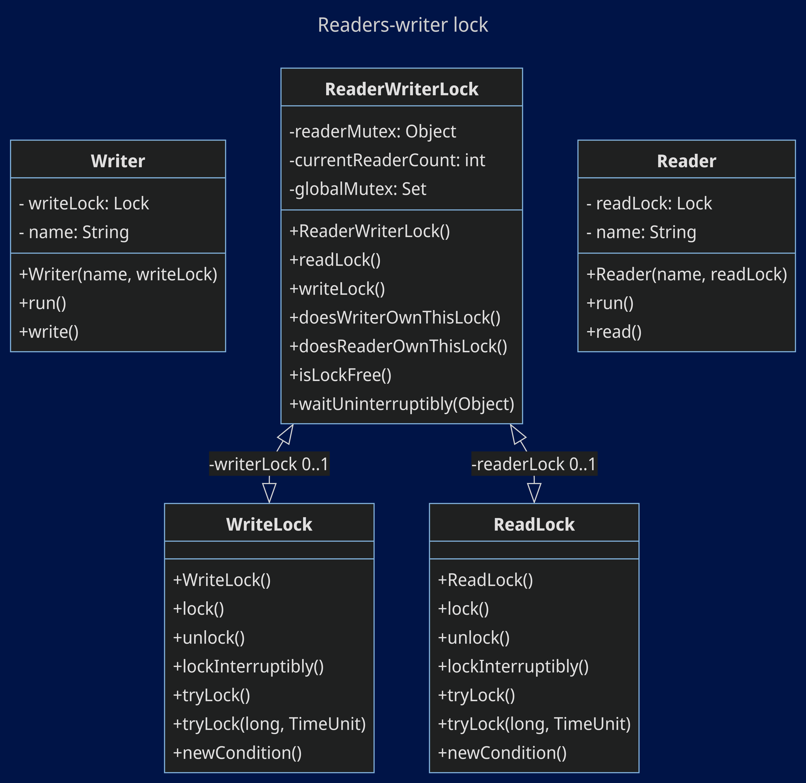

****
# :star2:  `Readers-writer lock`

### :black_nib:	Призначення та застосування шаблону
#### **Блокувач читання-запису** — добре відомий як «кілька одночасних читачів, одне блокування запису». Складається з кількох потоків, які одночасно зчитують, і дозволяють лише одному потоку записувати або змінювати дані. Усі інші пристрої читання чи запису будуть заблоковані, поки записувач змінює або записує, і розблоковані, доки записувач не закінчить запис.
###### Readers-writer lock значно продуктивніший, якщо кількість зчитувань у спільній пам'яті доволі перевищує кількість записів, чим дуже схожий на ефективність кешу.
#### **Застосовується :**
- коли потрібно **збільшити продуктивність синхронізації ресурсів для кількох потоків**, зокрема є змішані операції читання/запису;
- у системі банківських транзакцій, коли необхідно переконатися: якщо два користувачі здійснюють транзакцію за одним рахунком, **один чекатиме, поки інший завершить**;
- у таких сценаріях, як доступ до бази даних, забезпечуючи **одночасне читання, але ексклюзивний запис** для забезпечення узгодженості даних.

### Діаграми класів та стану

##### Class Diagram Readers-writer lock:

##### State Diagram Readers-writer lock:

### Опис основних структурних елементів :
- **Reader** - клас, який виконує операцію read, коли отримує блокування на читання. Він створює контруктори і симулює операцію читання;
- **Writer** - як і у випадку з Reader, виконує операцію write, коли отримує блокування на запис;
- **ReadWriteLock** - відповідає за керування доступом reader або writer;
- **ReadLock** обмежує: якщо немає writer, який отримує блокування, то декілька читачів можуть мати доступ одночасно;
- **WriteLock** обмежує доступ лише до одного writer.

###### На діаграмі станів зображено конкретні класи по шаблону. 

### Джерела інформації:
##### - [java-design-patterns.com](https://java-design-patterns.com/patterns/reader-writer-lock/)
##### - [www.stevenengelhardt.com](https://www.stevenengelhardt.com/2010/03/04/readerwriter-lock-pattern/)
##### - [medium.com](https://medium.com/@nirajranasinghe/design-patterns-for-concurrent-programming-reader-writer-pattern-f1f8fc80c0f7#:~:text=Implement%20Reader-Writer%20pattern&text=This%20lock%20guarantees%20exclusive%20access,process%2C%20and%20includes%20a%20Thread.)
****